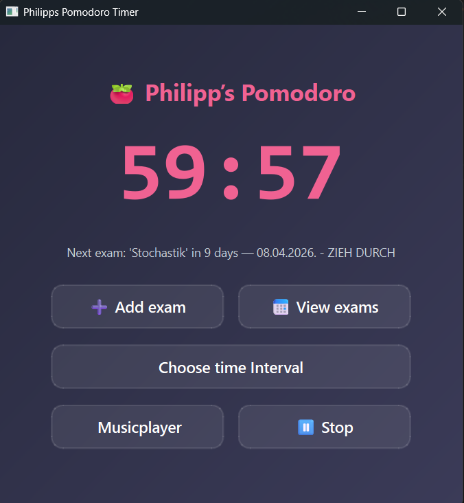
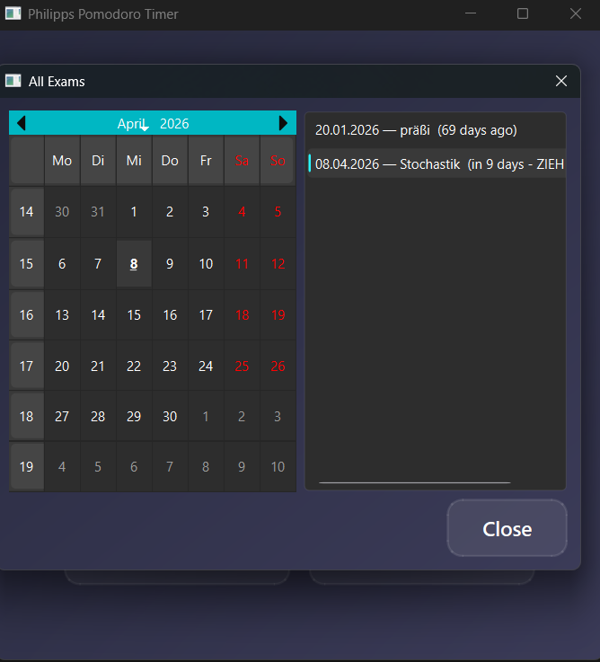
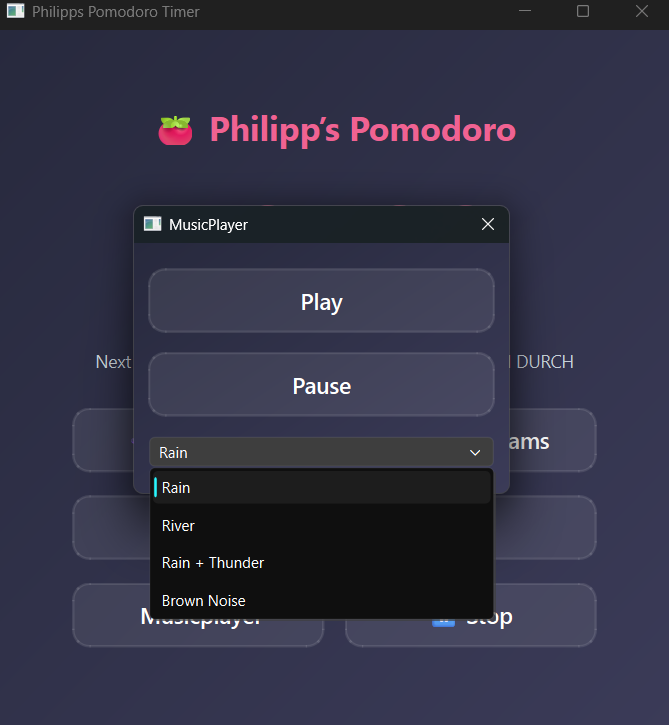

# Pomodoro App

A Pomodoro app built with **Python + PySide6** .  




## Features

- The classical pomodoro timer with the automatic swtich between the work and break mode.
- A music player with built in ASMR sounds like for example rain
- A calender to store the upcoming exams in, with a built in reminder on the front page in how many days the event takes place
---

## Installation & Usage

```bash
git clone https://github.com/Phil-gy/Projects.git
cd Projects/Python/LearningHub            
pip install -r requirements.txt
python src/LearningHub.py                   
