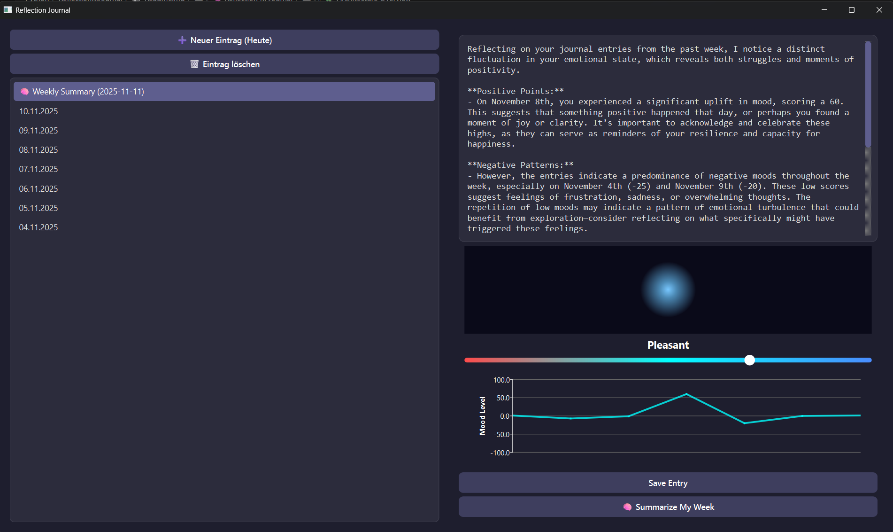

# 🧠 Reflection KI Journal  
_A minimalistic AI-powered journaling app built with PySide6_

> **“Your thoughts deserve reflection.”**  
> Reflection KI Journal helps you track your daily mood, write down your thoughts,  
> and receive weekly AI-generated summaries that highlight emotional trends,  
> personal growth, and recurring themes.

---

## ✨ Features

- 📝 **Daily Journal Entries** – Write and save personal notes for each day  
- 🌈 **Mood Tracking** – Use a color-animated mood slider to record how your day felt  
- 🧠 **AI Weekly Summary** – GPT-4 analyzes your past week and adds a reflective summary  
- 📊 **Mood Chart** – Visual overview of your emotional trend  
- 💾 **Persistent Storage** – All entries stored safely in a local `entries.json` file  
- 🗑️ **Entry Management** – Create, delete, or revisit past entries  
- 🇩🇪 **Localized Dates** – All dates shown in German format (e.g., `11.11.2025`)  
- 🎨 **Modern Dark UI** – Sleek, distraction-free interface built with PySide6  

---

## 🧩 Architecture Overview

