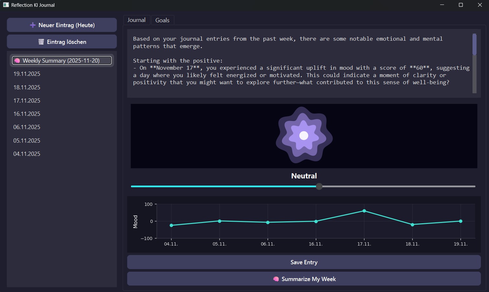
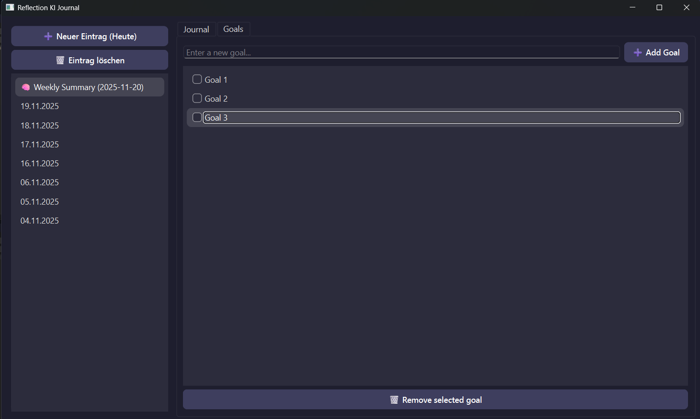

# 🧠 Reflection KI Journal  
_A minimalistic AI-powered journaling app built with PySide6_

---

## ✨ Features

- 📝 **Daily Journal Entries** - Write and save personal notes for each day  
- 🌈 **Mood Tracking** - Use a color-animated mood slider to record how your day felt  
- 🧠 **AI Weekly Summary** - GPT-4 analyzes your past week and adds a reflective summary  
- 📊 **Mood Chart** - Visual overview of your emotional trend  
-    **Goals Tab**  - Tab to store personal goals
- 💾 **Persistent Storage** - All entries stored safely in a local `entries.json` and an `goals.json` file  
- 🗑️ **Entry Management** - Create, delete, or revisit past entries    
- 🎨 **Modern Dark UI** - Sleek, distraction-free interface built with PySide6  

## 🧠 How the AI Summarization Works

Every week, you can click **“🧠 Summarize My Week”** inside the app.  
This triggers an OpenAI GPT-4 call that:
1. Collects your last 7 days of entries & moods  
2. Sends them as a structured prompt  
3. Generates a short, compassionate reflection summary  
4. Saves it as a new entry (e.g. `summary-2025-11-11`)  
   → shown in the sidebar with a 🧠 icon  
---

## 🧩 Architecture Overview
git clone https://github.com/Phil-gy/ReflectionKiJournal.git
cd ReflectionKiJournal

If you want to use the AI feature you have to setup your own api key.
